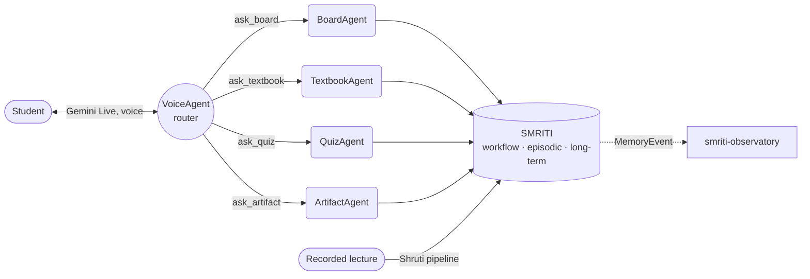

# Nityam

Nityam is a personalized learning partner: pick what you actually want to study (a chapter, a
problem set, a lecture you're stuck on) and work through it in conversation with a tutor that
teaches the way a good one does. It draws out what you already understand before adding to it,
checks understanding with a question instead of assuming the explanation landed, and only
re-explains, differently, when the gap turns out to be real. Every lesson is grounded in the
actual textbooks and lectures you're covering, so the same conversation can hold learning
something new, revising what's shaky, and chasing a tangent worth researching. And it remembers
exactly where you left off, the next time and every time after.

Built for the **Google All Things Agentic Hackathon** (track: *Collaborative Partner*), stateful
multi-turn dialogue with real-time retrieval and persistent memory.



*(Full detail, icon-accurate and built for redrawing in Excalidraw across five diagrams, lives in
[`docs/architecture-diagrams.html`](docs/architecture-diagrams.html).)*

## 🎓 From rote answers to real understanding

A tutor that just answers produces a student who can pass tonight's question and not next week's.
Nityam is built to keep the student doing the thinking, not just receiving it:

- **She asks, then stops.** Two or three sentences, then a question, then silence until the
  student answers. No long lectures.
- **One checkpoint per topic.** The moment something lands, a short quiz follows, before moving
  on, not saved for the end.
- **Wrong answers get real feedback.** Every wrong option is a real misconception, and every
  rebuttal says exactly what's wrong with it, never "try again."
- **Hints only on request.** A quiz question carries one hint, shown only if the student asks for
  it. The default is a real chance to think it through first.
- **Simulations you play with, not watch.** Every artifact is built around a specific
  misconception, and what the student discovers while playing with it becomes part of their
  record.
- **Marking the textbook starts a conversation.** Highlight a line, and that's what gets asked
  about next, not a note that disappears.
- **What's worked before gets remembered.** The tutor tracks which teaching style (Socratic
  questions, a worked example, guided practice) actually landed for this student, and reuses it.

This is what "Collaborative Partner" means here: not a smarter answer key, and not a video on
autoplay. A partner that keeps the student in the work.

## 🧭 The four pillars

Four things this build had to get right, in order, mapped to the hackathon's own focus areas:

**Hyper-personalized layer.** Personalization starts with what the student actually chooses to
study, and SMRITI is what keeps it personal after that: three memory tiers (a live workflow
buffer, a permanent per-session log, and long-term knowledge about the student) where every
stored claim cites the exact turn or lecture timestamp it came from. It isn't a prompt trick; it's
a schema-validated, evidence-gated write path, exercised once per session and checked against a
real multi-persona eval.

**Artifact generation engine.** ArtifactAgent turns "I don't get projectile motion" into an
interactive, student-specific visualization on demand, validated against an IR schema before it
ever reaches the canvas, and durable in Cloud Storage so a reload doesn't lose it. One stored
artifact, personalised at render time, serves every student who needs it.

**Multi-modal, by design.** One Gemini Live voice session doesn't just talk: it routes to four
specialists that write to a shared board, pull up textbook figures, publish quiz questions, and
render simulations, all inside the same conversation. Voice, board, text, and generated visuals
are one experience, not four disconnected surfaces.

**UX that hides the machinery.** The student never hears "let me call a tool": VoiceAgent speaks
every specialist's output as her own words, keeps talking while a specialist is still working
underneath her, and only interrupts herself when three separate timing gates agree it's safe to.
The complexity is real; the point is that it doesn't feel that way.

## ☁️ Built on Google Cloud, end to end

| Layer | Google technology | What it does here |
|---|---|---|
| Voice | Gemini Live (`gemini-live-2.5-flash`) | Real-time bidirectional speech: hears, speaks, routes |
| Reasoning | Gemini (`gemini-3.7-flash`) | All four specialist agents, plus Shruti's extraction passes |
| Orchestration | Agent Development Kit (ADK) | Every agent is an ADK `Runner`; non-blocking streaming tools carry the keep-talking mechanism |
| Compute | Cloud Run + Cloud Run Jobs | The tutor backend; Shruti's ingest pipeline as its own Job |
| Episodic + long-term memory | Firestore | `session_logs`, `dpm_profile`, `teaching_memory`, `grounding_chunks` (native vector search) |
| Workflow memory | Memorystore for Redis | The live per-turn buffer, and the Observatory's pub/sub channel |
| Generated artifacts | Cloud Storage | Durable copies of every `ArtifactAgent` output |
| Sign-in | Firebase Auth | ID-token verification on every WebSocket connection |
| CI/CD | Cloud Build + Artifact Registry + Secret Manager | Redeploys on every push to `main`; secrets never touch the build |

Memory made visible is its own honest addition, not a listed pillar: smriti-observatory streams
every memory read and write live as a session runs, including the writes that get *rejected*,
because a memory layer where every proposed write succeeds is indistinguishable from one with no
rules at all. See its own section below.

## 🏗️ Architecture

Five ADK agents behind one WebSocket, one storage gateway behind all of them:

| Agent | Model | Job | Owns |
|---|---|---|---|
| **VoiceAgent** | `gemini-live-2.5-flash` | Hears, speaks, routes | `read_screen`, `scroll_to`, four `ask_*` delegate tools |
| **BoardAgent** | `gemini-3.7-flash` | Writes the shared board | `write_lesson`, grounding + memory reads, `calculate` |
| **TextbookAgent** | `gemini-3.7-flash` | Finds the reference | `search_textbook`, `show_textbook_figure` |
| **QuizAgent** | `gemini-3.7-flash` | Tests understanding | `publish_quiz_question`, memory reads |
| **ArtifactAgent** | `gemini-3.7-flash` | Builds interactive visuals | `create_artifact`, `log_artifact_evidence` |

VoiceAgent never blocks on a specialist: calling one hands off to ADK's background-task registry,
which returns a free, synthetic "pending" response immediately. Three interruption gates
(`student_is_talking`, `she_just_spoke`, `mid_exchange`) and one per-specialist concurrency lock
keep the conversation coherent while up to four calls could plausibly be in flight. See
**Diagram 2** in the blueprints doc for the full delegation timeline.

### SMRITI, the memory layer

Three questions, three tiers:

| Tier | Answers | Backed by | Written |
|---|---|---|---|
| **Workflow** | What's happening *right now* in this turn? | Memorystore (Redis) + ADK `session.state` | Continuously, free |
| **Episodic** | What happened in *this* session? | Firestore `session_logs` | Once, at session close |
| **Long-term** | Who is this student, across *every* session? | Firestore `dpm_profile` + `teaching_memory` | Once, at session close, through a validated-operation gate |

Long-term memory is never written mid-session, for a reason stated plainly in the code:
*"you don't know what a turn meant until you see what followed it, and a file write inside a turn
is latency you don't need to pay."* At close, one model call (`reflect()`) proposes structured
operations against a JSON Schema; anything malformed is dropped before it touches Firestore.
Every weakness, doubt, and self-reflection carries `evidence: [session_id#turn]`, so a claim with
no citation cannot be written. See **Diagram 4**.

### Shruti, the ingest pipeline

**श्रुति · "that which is heard."** Ten stages (shot/ink-curve analysis, board recovery under
occlusion, code-mixed transcript, deixis resolution: "*this* term, *here*", Beat fusion, board
reading, concept-graph extraction) turn a lecture into a citable knowledge substrate, running as
its own Cloud Run Job against Cloud SQL + pgvector. Every concept and edge in the resulting graph
carries a `BeatRef` back to a real timestamp: *"a concept you cannot point at a moment in a
lecture is a concept you made up."* See **Diagram 3**, and note the one honest gap it draws: the
hop from Shruti's own store into the tutor's live Firestore corpus is a manual script today, not
an automated pipeline yet.

### smriti-observatory

A live view of SMRITI as a session runs: every read, every write, and the writes the
validation gate *rejected*, each correlated to its real trace span. Ships two ways: a maintained
fork of `google/adk-web` with a Memory tab built in, or a standalone React/FastAPI companion. See
`smriti-observatory/README.md`.

## 📂 Structure

- **`backend/`** + **`frontend/`**: the real production tutor, the five-agent voice loop above
  plus a shared canvas the tutor writes on and the student points at. Deployed to Cloud Run. See
  `backend/README.md` to run it, `backend/INTEGRATION.md` for the wiring details.
- **`landing/`**: the public marketing site (Next.js, deployed to Vercel). `backend/run.sh` starts
  it alongside the tutor; see `landing/README.md`.
- **`sub_modules_examples/tutor/`**: an ADK-scaffolded reference implementation of the same memory
  layer and agent topology, used for ADK-tooling-specific work (evals, the ADK dev-ui, the
  Observatory below). Runs side by side with `backend/` on different ports (`8010`/`4200` here vs
  `8210`/`5173` there); see its own `CLAUDE.md`. **`backend/app/memory/`** is a manually-synced
  copy of `sub_modules_examples/tutor/app/memory/`, and a fix landed in one needs porting to the
  other by hand; check both when touching memory-layer code.
- **`smriti-observatory/`**: real-time visualization of SMRITI memory state, built against the
  ADK reference implementation. See `smriti-observatory/README.md` for both ways to run it.
- **`sub_modules_examples/shruti/`**: the video-lecture-to-knowledge-graph extraction pipeline. A
  self-contained project (own `pyproject.toml`, `uv.lock`, tests). See
  `sub_modules_examples/shruti/docs/architecture.md` for the full ten-stage design.
- **`sub_modules_examples/artifact_generator/`**: generates the interactive physics
  visualizations (`ArtifactAgent`'s output) both `backend/` and `sub_modules_examples/tutor/`
  render.
- **`docs/architecture-diagrams.html`**: the five build-accurate diagrams referenced throughout
  this README (open it directly in a browser).
- **`project_documentation/`**: Nityam-level architecture and research, not specific to any one
  submodule:
  - `memory_nityam_architecture/`: the memory-layer/SMRITI architecture wiki (start at its
    `README.md`), covering the design, the Firestore/Redis/GCS migration, and the real
    multi-persona eval results.
  - `wiki/`: Google platform/ADK research that fed the platform decisions (start at
    `wiki/index.md`).

## Running the tutor

```bash
cd backend
cp .env.example .env        # then fill in credentials, or set NITYAM_AUTH=mock
./run.sh                    # backend + frontend + Observatory + landing page
```

Redis and Google Cloud credentials (ADC) are both needed beyond what's in `.env`; see
`backend/README.md`'s **Prerequisites** section before assuming a filled-in `.env` is enough on a
new machine. It isn't, on its own, for Firestore or sign-in.

See `backend/README.md` for the full picture: the agent topology, mock mode, and the
`scripts/drive.py` smoke test ("the one to reach for when the tutor stops writing on the board").

## Running Shruti

```bash
cd sub_modules_examples/shruti
uv sync
cp .env.example .env  # fill in your own credentials
uv run --env-file .env python -m shruti.cli ingest
```

See `sub_modules_examples/shruti/docs/architecture.md` and `sub_modules_examples/shruti/justfile`
for more commands.

## Memory-layer evals

`sub_modules_examples/tutor/tests/eval/memory_eval/` runs the real `TutorAgent` through five
multi-session student personas against real Firestore/Redis, with deterministic checks (D1-D7) and
LLM-as-judge checks (L1-L4); see `project_documentation/memory_nityam_architecture/README.md` for
the reading order and `memory_layer_eval_report.md` for the latest results.

```bash
cd sub_modules_examples/tutor
uv run python -m tests.eval.memory_eval.run_eval
```

## Deploying

Cloud Build redeploys the backend to Cloud Run on every push to `main` (`cloudbuild.yaml`): build,
push to Artifact Registry, deploy with `--session-affinity` and the `GOOGLE_API_KEY` secret pulled
from Secret Manager. Shruti runs as its own Cloud Run Job. See
`docs/superpowers/specs/2026-08-30-cloud-run-deployment-design.md` for the full design.

## ✅ Honest status

This codebase's own convention is to disclose gaps rather than smooth over them, and that's worth
keeping here too:

- **Citation faithfulness is strong**: 5/5 on an automated LLM-as-judge check, reproduced twice.
  The property SMRITI is specifically built to protect held up under real scrutiny.
- **Personalization and memory-causality are the open problem.** Does the tutor *visibly* use what
  it remembers to shape a new session's opening turn? That's the eval's own sharpest, still-open
  finding, not a solved feature.
- **Shruti's automation gap is real and disclosed.** The pipeline produces real, citable grounding
  chunks; nothing yet automates the hop into the tutor's live Firestore corpus, so a person runs
  `seed_demo_data.py` by hand today.
- **New sign-ins are demo-seeded** (`NITYAM_SEED_NEW_STUDENTS`) with a fabricated prior history, so
  a first session already looks personalized for a judge. Disclosed in-repo as a demo convenience;
  turn it off for real students.
